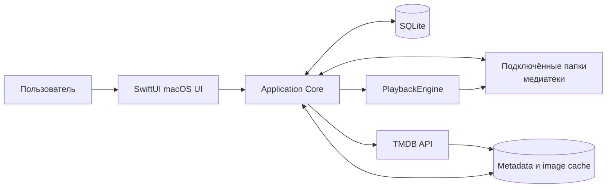
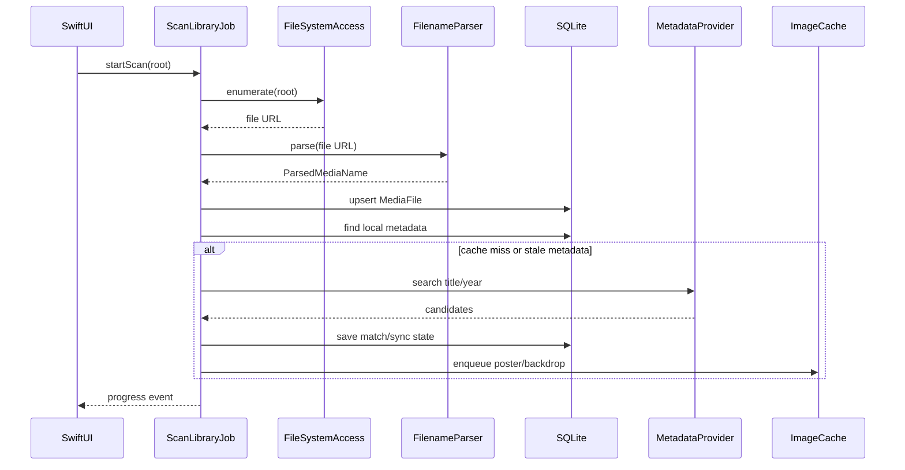
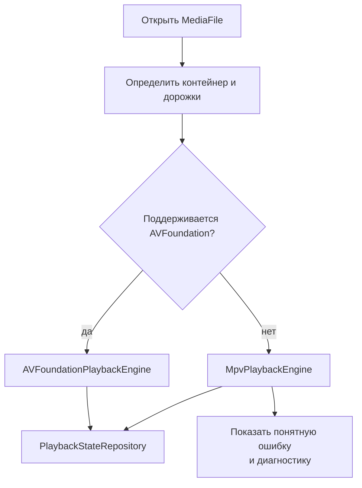

# CineVault — архитектура локальной медиатеки

> Устаревшая версия. После уточнения идеи актуальна [CineVault Online — архитектура](</Users/aleksandrbasov/Documents/сериал для нас с любимой/docs/CineVault-Online-Architecture.md>).

## 1. Архитектурное решение

Для личного macOS-приложения выбираем локальную modular monolith архитектуру:

- один native macOS bundle;
- SwiftUI для интерфейса;
- Swift Concurrency (`async/await`, actors) для фоновых задач;
- SQLite для локальной базы;
- AVFoundation/AVKit как первый медиастек;
- отдельный `PlaybackEngine` для возможного mpv backend;
- TMDB как внешний provider метаданных;
- Keychain для секретов;
- App Sandbox + security-scoped bookmarks для доступа к выбранным папкам.

SwiftUI подходит для единого декларативного интерфейса macOS, а AVKit предоставляет системный медиаплеер с транспортными контролами и субтитрами. Доступ к выбранным пользователем папкам в sandbox сохраняется через security-scoped bookmark.

Источники: [SwiftUI](https://developer.apple.com/documentation/SwiftUI), [AVKit](https://developer.apple.com/documentation/avkit), [security-scoped bookmark](https://developer.apple.com/documentation/Foundation/NSURL/BookmarkCreationOptions/withSecurityScope).

## 2. Контекст системы



Приложение не требует собственного backend для MVP. Это снижает стоимость, количество точек отказа и риск утечки локальной медиатеки.

## 3. Слои и модули

```text
CineVault/
├── App/
│   ├── CineVaultApp.swift
│   ├── AppEnvironment.swift
│   └── DependencyContainer.swift
├── Features/
│   ├── Home/
│   ├── Library/
│   ├── Search/
│   ├── Details/
│   ├── Player/
│   ├── Collections/
│   └── Settings/
├── Domain/
│   ├── Models/
│   ├── UseCases/
│   └── Repositories/
├── Data/
│   ├── Database/
│   ├── FileSystem/
│   ├── Metadata/
│   ├── Cache/
│   └── Keychain/
├── Playback/
│   ├── PlaybackEngine.swift
│   ├── AVFoundationPlaybackEngine.swift
│   └── MpvPlaybackEngine.swift
├── Jobs/
│   ├── ScanLibraryJob.swift
│   ├── MetadataSyncJob.swift
│   ├── ImagePrefetchJob.swift
│   └── CleanupCacheJob.swift
├── Infrastructure/
│   ├── Logging/
│   ├── Networking/
│   └── FileWatching/
└── Tests/
```

### Правило зависимостей

```text
Features -> Domain -> Repositories protocols
Data     -> Domain protocols
Infrastructure -> Data/Domain
Playback -> Domain playback contracts
```

SwiftUI views не должны напрямую выполнять SQL, ходить в TMDB или читать каталоги. View вызывает use case или получает состояние от feature model.

## 4. Основные протоколы

```swift
protocol LibraryScanner: Sendable {
    func scan(roots: [LibraryRoot]) async -> AsyncThrowingStream<ScanEvent, Error>
}

protocol FilenameParser: Sendable {
    func parse(url: URL) -> ParsedMediaName?
}

protocol MetadataProvider: Sendable {
    func searchMovie(title: String, year: Int?) async throws -> [MetadataMatch]
    func searchSeries(title: String, year: Int?) async throws -> [MetadataMatch]
    func loadDetails(for externalID: String, kind: MediaKind) async throws -> RemoteMediaDetails
}

protocol PlaybackEngine: AnyObject {
    var state: PlaybackStatePublisher { get }
    func open(file: MediaFile, startAt: Duration?) async throws
    func play()
    func pause()
    func seek(to: Duration)
    func selectAudioTrack(id: String?)
    func selectSubtitle(id: String?)
    func close()
}
```

Протоколы нужны не ради абстракции «на будущее», а для тестирования: scanner, parser, provider и player можно заменить fake-реализациями без файловой системы, сети и реального плеера.

## 5. Поток импорта



### Идемпотентность

Для каждого файла вычисляется `file_fingerprint`:

- volume/resource identifier;
- file size;
- modification date;
- быстрый hash первых и последних блоков;
- полный hash — только по запросу или для спорных дублей.

Путь не должен быть единственным идентификатором: файл может быть перемещён. При изменении fingerprint запись обновляется, а не создаётся заново.

## 6. Схема SQLite

```sql
CREATE TABLE media_items (
    id TEXT PRIMARY KEY,
    kind TEXT NOT NULL CHECK (kind IN ('movie', 'series')),
    title TEXT NOT NULL,
    original_title TEXT,
    year INTEGER,
    overview TEXT,
    poster_path TEXT,
    backdrop_path TEXT,
    tmdb_id INTEGER,
    metadata_state TEXT NOT NULL,
    is_favorite INTEGER NOT NULL DEFAULT 0,
    created_at TEXT NOT NULL,
    updated_at TEXT NOT NULL
);

CREATE TABLE media_files (
    id TEXT PRIMARY KEY,
    media_item_id TEXT REFERENCES media_items(id),
    episode_id TEXT,
    root_id TEXT NOT NULL REFERENCES library_roots(id),
    bookmark_data BLOB NOT NULL,
    relative_path TEXT NOT NULL,
    filename TEXT NOT NULL,
    extension TEXT NOT NULL,
    size_bytes INTEGER NOT NULL,
    modified_at TEXT NOT NULL,
    fingerprint TEXT NOT NULL UNIQUE,
    availability TEXT NOT NULL,
    duration_ms INTEGER,
    width INTEGER,
    height INTEGER,
    video_codec TEXT,
    audio_summary TEXT,
    imported_at TEXT NOT NULL,
    updated_at TEXT NOT NULL
);

CREATE TABLE episodes (
    id TEXT PRIMARY KEY,
    series_id TEXT NOT NULL REFERENCES media_items(id),
    season_number INTEGER NOT NULL,
    episode_number INTEGER NOT NULL,
    title TEXT,
    overview TEXT,
    air_date TEXT,
    tmdb_id INTEGER,
    UNIQUE(series_id, season_number, episode_number)
);

CREATE TABLE playback_states (
    media_file_id TEXT PRIMARY KEY REFERENCES media_files(id),
    position_ms INTEGER NOT NULL DEFAULT 0,
    duration_ms INTEGER,
    progress REAL NOT NULL DEFAULT 0,
    status TEXT NOT NULL,
    last_played_at TEXT,
    completed_at TEXT
);

CREATE TABLE library_roots (
    id TEXT PRIMARY KEY,
    display_name TEXT NOT NULL,
    bookmark_data BLOB NOT NULL,
    enabled INTEGER NOT NULL DEFAULT 1,
    last_scan_at TEXT,
    created_at TEXT NOT NULL
);

CREATE TABLE metadata_syncs (
    media_item_id TEXT PRIMARY KEY REFERENCES media_items(id),
    provider TEXT NOT NULL,
    external_id TEXT,
    state TEXT NOT NULL,
    last_attempt_at TEXT,
    last_success_at TEXT,
    error_code TEXT,
    retry_count INTEGER NOT NULL DEFAULT 0
);

CREATE TABLE collections (
    id TEXT PRIMARY KEY,
    name TEXT NOT NULL,
    created_at TEXT NOT NULL,
    updated_at TEXT NOT NULL
);

CREATE TABLE collection_items (
    collection_id TEXT REFERENCES collections(id),
    media_item_id TEXT REFERENCES media_items(id),
    PRIMARY KEY (collection_id, media_item_id)
);
```

Для поиска добавить FTS5 virtual table по `title`, `original_title`, `overview`, `filename`, `person_name` и триггеры или явное обновление индекса из repository layer.

## 7. Метаданные и сеть

### Adapter

`TMDBClient` не должен быть виден feature-модулям. Он реализует `MetadataProvider`, ограничивает частоту запросов, обрабатывает ошибки и возвращает доменные модели.

Хранить:

- локальный `media_item.id`;
- `provider = tmdb`;
- `tmdb_id`;
- дату последнего успешного обновления;
- версию/хэш ответа при необходимости;
- локальный manual override.

Изображение строится из `base_url + file_size + file_path`, которые TMDB предоставляет через configuration API. В приложении нужен экран About/Credits с обязательной атрибуцией TMDB и текстом о том, что продукт не одобрен TMDB. См. [TMDB image basics](https://developer.themoviedb.org/docs/image-basics) и [TMDB FAQ](https://developer.themoviedb.org/docs/faq).

### Политика сети

- timeout запроса: 15 секунд;
- максимум 3 сетевых запроса одновременно;
- retry только для timeout, временного DNS/соединения и HTTP 429/5xx;
- не повторять 4xx, кроме 429;
- при rate limit использовать `Retry-After`, если он есть;
- не обновлять уже свежие данные без необходимости;
- все операции отменяемые через `Task` cancellation.

### Режим offline

Если сеть недоступна:

- не удалять локальные метаданные;
- показать stale badge;
- не блокировать просмотр;
- добавить задачу на повторную синхронизацию.

## 8. Доступ к файловой системе

Приложение запускается в App Sandbox. Пользователь выбирает корневую папку через `NSOpenPanel`. Для каждой папки сохраняется security-scoped bookmark. Перед чтением вызывается `startAccessingSecurityScopedResource()`, после завершения операции — `stopAccessingSecurityScopedResource()`.

Нельзя:

- сканировать весь диск без явного разрешения;
- сохранять абсолютные пути в экспортируемые логи;
- удалять исходные файлы при очистке кэша;
- считать отсутствие доступа поводом удалить запись.

Если bookmark устарел, приложение просит выбрать папку заново и сохраняет запись в статусе `access_required`.

## 9. Фоновые задачи и состояние

Каждая job имеет:

- `id`;
- тип;
- состояние `queued/running/succeeded/failed/cancelled`;
- прогресс;
- число успехов и ошибок;
- последнее сообщение;
- `started_at` и `finished_at`.

Задачи:

1. `ScanLibraryJob` — перечисление файлов и upsert.
2. `ProbeMediaJob` — техническая информация через AVAsset/ffprobe.
3. `MetadataSyncJob` — поиск и обновление карточки.
4. `ImagePrefetchJob` — загрузка постеров и фонов.
5. `WatchFolderJob` — реакция на изменения файловой системы.
6. `CleanupCacheJob` — очистка по LRU и лимиту.

Сканирование не должно запускать отдельный сетевой запрос на каждый найденный файл синхронно. Сначала импортируются все локальные записи, затем строится очередь metadata jobs.

## 10. Плеер и форматы



Технический spike обязателен, потому что заявленные MKV, AVI, HEVC, HDR, Dolby Vision, ASS/SSA и 5.1/7.1 не гарантируют одинаковую поддержку у системного AVFoundation на всех версиях macOS.

`PlaybackEngine` обязан публиковать:

- текущую позицию;
- длительность;
- состояние play/pause/buffering/ended/error;
- список аудиотреков;
- список субтитров;
- фактический backend;
- код ошибки и диагностическое сообщение.

## 11. Кэш и хранение

```text
~/Library/Application Support/CineVault/
├── CineVault.sqlite
├── Cache/
│   ├── metadata/
│   ├── images/
│   └── thumbnails/
├── Logs/
└── Exports/
```

Не хранить медиаконтент в `Application Support` по умолчанию. Внешние файлы остаются в выбранных пользователем папках. Если появится media cache, он должен быть явно включён в настройках и иметь отдельный лимит.

Ключ изображения: `provider + external_id + asset_type + size + version`.  
Политика очистки: сначала удалять давно неиспользуемые миниатюры, затем фоны, затем постеры; metadata cache очищать последним.

## 12. Состояние интерфейса

Каждая feature-модель должна иметь явные состояния:

```swift
enum LoadState<Value> {
    case idle
    case loading
    case loaded(Value)
    case empty
    case failed(UserFacingError)
}
```

Нельзя превращать сетевую ошибку в пустую библиотеку. В UI должны различаться:

- библиотека действительно пуста;
- идёт первый импорт;
- нет доступа к папке;
- метаданные ещё не загружены;
- метаданные устарели;
- файл отсутствует;
- файл не поддерживается плеером.

## 13. Логирование и диагностика

Использовать категории `scan`, `metadata`, `playback`, `database`, `cache`, `filesystem`, `ui`.

Стандартная строка лога должна отвечать на вопросы:

- какая операция;
- над каким локальным ID;
- результат;
- длительность;
- код ошибки, если есть.

Не логировать API-токены, содержимое JSON целиком, абсолютные пути и персональные данные. Для поддержки предусмотреть экспорт sanitized diagnostics: версия приложения, macOS, backend плеера, счётчики ошибок и список типов файлов.

## 14. Тестирование

### Unit

- parser названий фильмов и сериалов;
- нормализация Unicode и пунктуации;
- извлечение сезона/эпизода;
- fingerprint и дедупликация;
- retry policy;
- расчёт прогресса и статуса completed;
- cache eviction;
- миграции SQLite.

### Integration

- сканирование временной папки;
- повторное сканирование без дубликатов;
- смена имени и перемещение файла;
- offline metadata mode;
- восстановление после невалидного bookmark;
- сохранение прогресса после перезапуска.

### UI

- пустая библиотека;
- прогресс импорта;
- ошибка доступа;
- карточка без постера;
- сериал с несколькими сезонами;
- keyboard shortcuts плеера.

### Набор тестовых файлов

Подготовить небольшой локальный fixture-набор, не включающий чужой защищённый контент: короткие тестовые видео и искусственные имена файлов для MP4/MKV/AVI, внешние SRT/ASS, разные кодеки и повреждённый файл.

## 15. Риски и решения

| Риск | Влияние | Решение |
|---|---|---|
| AVFoundation не играет часть MKV/AVI | высокое | playback abstraction и spike с mpv |
| API TMDB недоступен или изменился | среднее | локальный кэш, provider adapter, offline режим |
| неправильное распознавание имени | среднее | ручное сопоставление и explainable parser |
| перемещение папки | среднее | security-scoped bookmark и reauthorization flow |
| большая медиатека | высокое | streaming scan, индексы, ленивые изображения |
| повреждение базы при выключении | высокое | WAL, транзакции, миграции и backup/export |
| утечка токена | высокое | Keychain, redacted logs, не хранить секреты в git |

## 16. Первый технический спринт

1. Создать macOS SwiftUI target.
2. Подключить SQLite слой и миграции.
3. Сделать экран добавления папки и хранение bookmark.
4. Реализовать scanner для одного корня.
5. Написать parser имени фильма и тесты.
6. Отобразить локальный список файлов без внешних метаданных.
7. Провести playback spike на реальных тестовых форматах.
8. После фиксации player decision подключить TMDB adapter.

Definition of Done спринта: папка добавляется, 20 тестовых файлов импортируются, повторный scan не создаёт дубликатов, поддерживаемый файл запускается, а все ошибки видны в UI и тестах.
