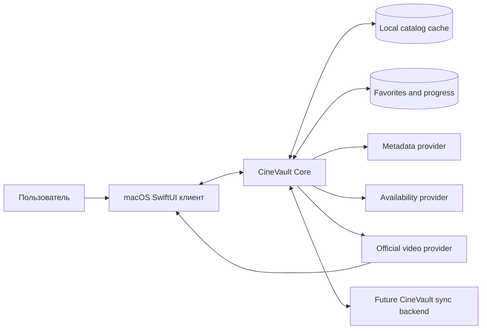
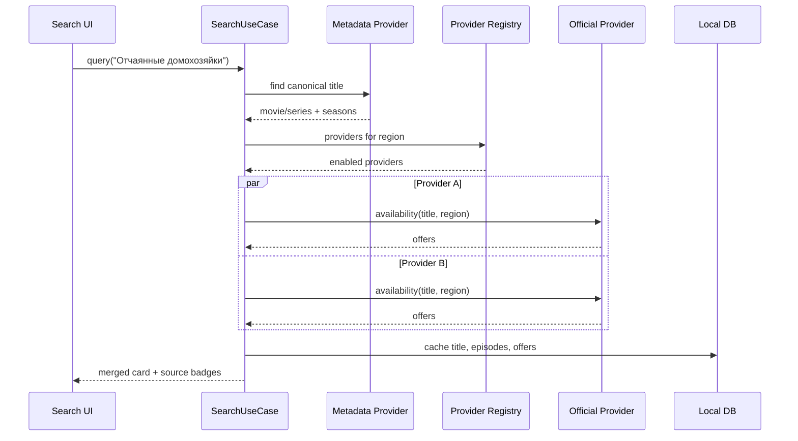
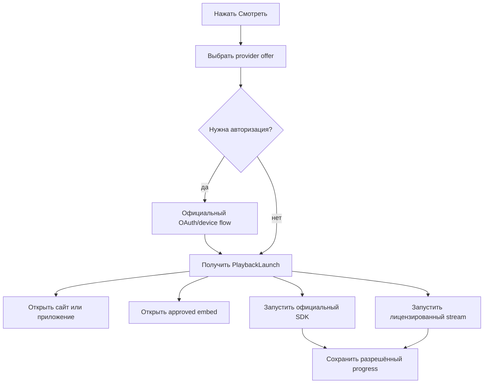
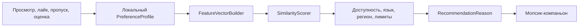
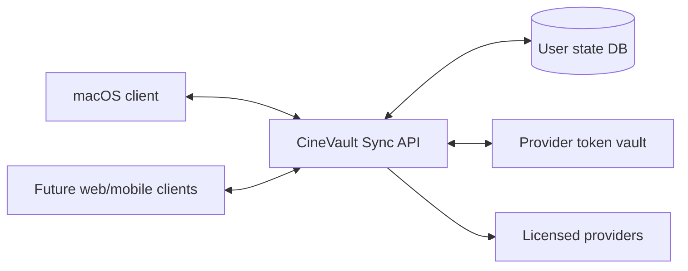

# CineVault Online — архитектура

Последнее уточнение: первый питомец — мопсик; рекомендации должны работать локально и бесплатно без обязательной LLM. Нейросеть является опциональным слоем над локальным recommendation engine.

## 1. Основной принцип

CineVault Online — не хранилище видео и не универсальный загрузчик. Это локальный клиент с единым каталогом, системой provider adapters и пользовательским состоянием.

Видео остаётся у официального источника. Приложение получает либо разрешённый playback flow, либо ссылку на официальный просмотр. Кэширование видео допускается только в режиме, предусмотренном провайдером.

## 2. Контекст системы



`Provider` — внешняя платформа, которая сама отвечает за права, подписку, DRM и выдачу видео. `Backend` появляется только на следующем этапе и синхронизирует состояние, а не видеофайлы.

## 3. Компоненты

```text
CineVault/
├── App/
│   ├── CineVaultApp.swift
│   ├── AppEnvironment.swift
│   └── DependencyContainer.swift
├── Features/
│   ├── Home/
│   ├── Search/
│   ├── TitleDetails/
│   ├── Watch/
│   ├── Favorites/
│   ├── Collections/
│   ├── Companion/
│   ├── Recommendations/
│   └── Settings/
├── Domain/
│   ├── Models/
│   ├── UseCases/
│   ├── Repositories/
│   └── ProviderContracts/
├── Providers/
│   ├── Metadata/
│   ├── Availability/
│   ├── OfficialPlayback/
│   └── ProviderRegistry.swift
├── Data/
│   ├── SQLite/
│   ├── Cache/
│   ├── Keychain/
│   └── SecureStorage/
├── Playback/
│   ├── PlaybackCoordinator.swift
│   ├── PlaybackProgressTracker.swift
│   ├── DeepLinkPlayback.swift
│   ├── OfficialEmbedPlayback.swift
│   └── LicensedStreamPlayback.swift
├── Sync/
│   └── FutureSyncClient.swift
├── Recommendations/
│   ├── RecommendationEngine.swift
│   ├── PreferenceProfileStore.swift
│   ├── FeatureVectorBuilder.swift
│   ├── SimilarityScorer.swift
│   └── LocalAssistant.swift
└── Tests/
```

В этой версии нет `LibraryScanner` и `LibraryRoot`: пользователь не импортирует собственные видеофайлы. Если позже появится поддержка личных файлов, её нужно сделать отдельным feature-модулем, не смешивая с online-потоком.

## 3.1. Питомец-компаньон

Первый питомец — мопсик. Он состоит из независимых слоёв:

1. `CompanionView` — внешний вид, состояния и анимации.
2. `CompanionCopy` — короткие реплики.
3. `RecommendationEngine` — реальные расчёты, которые питомец озвучивает.
4. `CompanionPreferences` — выбранный питомец, тон и частота подсказок.

Питомец не должен сам придумывать доступные фильмы. Любая рекомендация приходит из `RecommendationEngine` и содержит список причин.

## 3.2. PlaybackCoordinator и продолжение просмотра

`PlaybackCoordinator` — единая точка входа для запуска фильма или эпизода из карточки, поиска и блока «Продолжить просмотр».

```swift
struct ResumePoint: Sendable {
    let contentID: String
    let providerID: String?
    let episodeID: String?
    let seasonNumber: Int?
    let episodeNumber: Int?
    let positionMilliseconds: Int64
    let durationMilliseconds: Int64?
    let updatedAt: Date
}

protocol PlaybackProgressTracker: Sendable {
    func loadResumePoint(contentID: String,
                         providerID: String?,
                         episodeID: String?) async throws -> ResumePoint?
    func save(progress: PlaybackProgress) async
    func markCompleted(contentID: String, episodeID: String?) async
}
```

### События плеера

```text
playbackOpened -> загрузить ResumePoint
playing        -> начать throttled progress updates
paused         -> немедленно сохранить позицию
periodicTick   -> сохранять не чаще 1 раза в 5–10 секунд
backgrounded   -> flush последнего состояния
ended          -> markCompleted + предложить next episode
error          -> сохранить последнюю подтверждённую позицию
```

Ключ записи учитывает провайдера и эпизод. Один и тот же сериал у разных источников не должен случайно смешивать прогресс.

| Playback mode | Точная позиция | Поведение |
|---|---:|---|
| `licensed_stream` | да | сохранить секунды и запустить с них |
| `official_sdk` | да, если SDK даёт callback | сохранять через SDK events |
| `official_embed` | зависит от callback | использовать callback, иначе только статус запуска |
| `deep_link` | нет | открыть источник и показать ограниченный локальный статус |

Нельзя обещать точный resume для внешнего браузера: приложение не должно читать чужую вкладку, перехватывать запросы или извлекать внутренние данные плеера.

## 4. Provider adapter

Каждый провайдер подключается через контракт:

```swift
protocol VideoProvider: Sendable {
    var id: String { get }
    var displayName: String { get }
    var supportedRegions: Set<String> { get }

    func authenticate() async throws -> ProviderSession
    func availability(for title: CanonicalTitle,
                      region: String) async throws -> [AvailabilityOffer]
    func playback(for episodeOrMovie: ProviderAsset,
                  account: ProviderSession?) async throws -> PlaybackLaunch
    func offlinePolicy(for asset: ProviderAsset,
                       account: ProviderSession?) async throws -> OfflinePolicy
}

enum PlaybackLaunch: Sendable {
    case deepLink(URL)
    case officialEmbed(URL, token: String?)
    case officialSDK(ProviderPlaybackSession)
    case licensedStream(ManifestDescriptor)
}

enum OfflinePolicy: Sendable {
    case unavailable(reason: String)
    case allowed(OfflineManifest)
}
```

Нельзя добавлять в `VideoProvider` метод вроде `downloadArbitrary(url:)`. Такой контракт делает небезопасную модель частью архитектуры.

## 5. Поток поиска и доступности



Offer должен иметь срок актуальности. Для старого offer UI показывает «проверяем доступность», а не выдаёт его за гарантированно рабочий источник.

## 6. Поток просмотра



Deep link обычно не позволяет CineVault получать точный прогресс. В таком случае пользователь видит локальную кнопку «Отметить просмотренным», а автоматическая синхронизация появляется только для SDK/approved embed.

## 7. Локальная база

```sql
CREATE TABLE titles (
    id TEXT PRIMARY KEY,
    kind TEXT NOT NULL CHECK (kind IN ('movie', 'series')),
    title TEXT NOT NULL,
    original_title TEXT,
    year INTEGER,
    overview TEXT,
    poster_url TEXT,
    backdrop_url TEXT,
    metadata_provider TEXT NOT NULL,
    metadata_external_id TEXT NOT NULL,
    metadata_updated_at TEXT,
    created_at TEXT NOT NULL,
    updated_at TEXT NOT NULL,
    UNIQUE(metadata_provider, metadata_external_id)
);

CREATE TABLE episodes (
    id TEXT PRIMARY KEY,
    title_id TEXT NOT NULL REFERENCES titles(id),
    season_number INTEGER NOT NULL,
    episode_number INTEGER NOT NULL,
    title TEXT,
    overview TEXT,
    air_date TEXT,
    runtime_seconds INTEGER,
    external_id TEXT,
    UNIQUE(title_id, season_number, episode_number)
);

CREATE TABLE provider_offers (
    id TEXT PRIMARY KEY,
    title_id TEXT REFERENCES titles(id),
    episode_id TEXT REFERENCES episodes(id),
    provider_id TEXT NOT NULL,
    region TEXT NOT NULL,
    access_type TEXT NOT NULL,
    playback_mode TEXT NOT NULL,
    deep_link TEXT,
    quality TEXT,
    audio_languages_json TEXT,
    subtitle_languages_json TEXT,
    requires_subscription INTEGER NOT NULL DEFAULT 0,
    checked_at TEXT NOT NULL,
    expires_at TEXT,
    state TEXT NOT NULL
);

CREATE TABLE user_progress (
    content_id TEXT NOT NULL,
    provider_id TEXT,
    episode_id TEXT,
    season_number INTEGER,
    episode_number INTEGER,
    position_seconds INTEGER NOT NULL DEFAULT 0,
    duration_seconds INTEGER,
    progress REAL NOT NULL DEFAULT 0,
    completed INTEGER NOT NULL DEFAULT 0,
    last_started_at TEXT,
    last_played_at TEXT,
    completed_at TEXT,
    updated_at TEXT NOT NULL,
    PRIMARY KEY (content_id, provider_id, episode_id)
);

CREATE TABLE favorites (
    title_id TEXT PRIMARY KEY REFERENCES titles(id),
    created_at TEXT NOT NULL
);

CREATE TABLE provider_accounts (
    provider_id TEXT PRIMARY KEY,
    account_subject TEXT,
    keychain_reference TEXT,
    region TEXT NOT NULL,
    connected_at TEXT NOT NULL
);

CREATE TABLE preference_events (
    id TEXT PRIMARY KEY,
    content_id TEXT NOT NULL,
    event_type TEXT NOT NULL,
    value REAL,
    created_at TEXT NOT NULL
);

CREATE TABLE recommendation_cache (
    id TEXT PRIMARY KEY,
    context_key TEXT NOT NULL,
    content_id TEXT NOT NULL,
    score REAL NOT NULL,
    reasons_json TEXT NOT NULL,
    generated_at TEXT NOT NULL,
    expires_at TEXT,
    UNIQUE(context_key, content_id)
);

CREATE TABLE companion_preferences (
    id TEXT PRIMARY KEY,
    companion_id TEXT NOT NULL,
    speech_enabled INTEGER NOT NULL DEFAULT 1,
    animation_enabled INTEGER NOT NULL DEFAULT 1,
    tone TEXT NOT NULL DEFAULT 'warm',
    updated_at TEXT NOT NULL
);
```

Пароли и refresh tokens не хранятся в SQLite. В базе лежит только ссылка на запись Keychain.

`user_progress` хранит только маленькие записи о просмотре. Видео и сегменты в неё не попадают. Для блока «Продолжить просмотр» нужен индекс по `updated_at`, `completed` и `last_played_at`.

## 8. Каталог и TMDB-подобный metadata provider

Metadata provider отвечает за каноническую сущность: название, сезоны, эпизоды, постеры, описания и внешние IDs. Он не должен считаться источником видео.

Availability provider отвечает на другой вопрос: где и на каких условиях этот объект можно посмотреть. Эти две ответственности разделяются, чтобы смена каталога не ломала просмотр.

Для TMDB нужно соблюдать их правила атрибуции и построения URL изображений; официальные сведения находятся в [Image Basics](https://developer.themoviedb.org/docs/image-basics) и [FAQ](https://developer.themoviedb.org/docs/faq).

## 8.1. Локальный recommendation engine

### Данные профиля

```text
PreferenceProfile
├── likedGenres: Map<Genre, Weight>
├── likedPeople: Map<PersonID, Weight>
├── likedKeywords: Map<Keyword, Weight>
├── preferredRuntimeRange
├── preferredLanguages
├── moodWeights
├── completedTitles
├── skippedTitles
└── updatedAt
```

### Пайплайн



### Правило производительности

Пересчёт выполняется только при изменении каталога, профиля или настроения. Для главной страницы используются готовые результаты из `recommendation_cache`. Прокрутка каталога никогда не запускает модель или полный пересчёт.

### Опциональная локальная модель

`LocalAssistant` может переформулировать готовую причину рекомендации, отвечать на запрос «хочу что-то как ...» и превращать текст в фильтры. Модель не должна самостоятельно придумывать title IDs, провайдеров или availability. Конкретная модель выбирается после замеров памяти и скорости на MacBook пользователя. [Core ML](https://developer.apple.com/documentation/coreml/) поддерживает предсказания на устройстве; [llama.cpp](https://github.com/ggml-org/llama.cpp) поддерживает локальные модели и Apple Silicon.

## 9. Состояние offline

```text
Online:
  metadata -> local cache
  availability -> local cache with expiry
  playback -> official provider

Offline:
  metadata -> local cache
  availability -> stale local cache with badge
  playback -> only licensed offline assets
```

Не считать обычный HTTP cache видео «offline support». Настоящий offline режим требует разрешённой лицензии, ключей и политики провайдера.

## 10. Backend следующего этапа



Backend должен предоставлять:

- регистрацию и вход CineVault;
- sync cursor или timestamps;
- merge избранного и коллекций;
- sync progress;
- device management;
- provider account linking.

Он не должен предоставлять endpoint вида `/download?url=...` для чужих видеопотоков.

## 11. Безопасность

- OAuth/device flow вместо хранения паролей;
- токены — macOS Keychain;
- HTTPS/TLS;
- минимальные scopes provider API;
- редактирование логов;
- sandbox;
- отсутствие скрытого сбора истории;
- отдельное согласие на синхронизацию;
- удаление provider account с отзывом токена.
- progress events не содержат видео и не требуют аккаунта CineVault;
- локальный режим является полноценным для одного Mac;
- будущая синхронизация переносит только progress/favorites/settings, а не видео.
- локальный recommendation profile не покидает Mac без отдельного согласия;
- локальная модель не получает доступ к provider credentials;
- питомец получает только title metadata и безопасные причины рекомендации.

## 12. Тестирование

### Unit

- нормализация названий;
- объединение сезонов и эпизодов;
- сортировка offers;
- региональные состояния;
- expiry и refresh policy;
- merge progress;
- offline policy gate;
- Keychain repository через mock.

### Integration

- provider adapter на sandbox/test account;
- OAuth callback;
- deep link;
- approved embed;
- offline catalog;
- недоступный источник;
- истёкший offer;
- отсутствие сети во время просмотра.

### Запретительные тесты

- adapter не создаёт произвольные download URL;
- неизвестный playback mode не запускается;
- offer без подтверждённого provider ID не показывается как доступный;
- offline button скрыта при `unavailable`;
- токены не попадают в логи и экспорт диагностики.

## 13. Реальный порядок разработки

1. Выбрать первый легальный provider и получить его официальную документацию/доступ.
2. Проверить регион, подписку, качество, русский дубляж и способ playback для «Отчаянных домохозяек».
3. Сделать каталог без видео и без скачивания.
4. Подключить deep links — это самый быстрый рабочий MVP.
5. Только после подтверждения прав и SDK делать embedded playback.
6. Только при наличии официального offline API делать кэширование видео.
7. Затем добавлять backend синхронизации пользовательского состояния.
